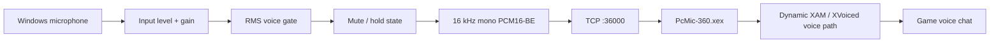

# PcMic-360

**Use a Windows PC or android device microphone as an Xbox 360 voice-chat microphone on a homebrew-enabled console.**

PcMic-360 streams low-latency microphone audio over your local network to an Xbox 360 XEX that dynamically connects to the system voice path. The current stable source in this repository is **PC GUI v1.5 + XEX v7.04**.

   

> [!IMPORTANT]
> **Safe unload rule for XEX v7.04:** while PcMic is connected, use **RESTORE / SAFE UNLOAD** and wait for `SAFE_TO_UNLOAD` before manually unloading `PcMic-360.xex`. If the network connection is unexpectedly lost while the hook is installed, **do not manually unload the XEX from a module loader**. Reboot the console before unloading/reloading that session.

## Features

- Windows microphone → Xbox 360 voice-chat path over LAN
- No physical Xbox headset required when the virtual-headset path is active
- Automatic voice-hook installation after connection
- Dynamic XAM / XVoiced discovery instead of title-specific hardcoded game offsets
- Microphone input-device selector
- Mic Input Level: `0–100%`
- Digital Mic Gain: `0.00×–4.00×`
- RMS voice gate with configurable threshold
- Mute toggle and hold-to-mute / hold-to-talk behavior
- Global `M` and `Space` hotkeys while Live Mic is active
- Live RMS meter and transport diagnostics
- PC-side stale-frame dropping to reduce delayed/bursty audio
- Xbox no-wire performance path: `perf=VIRTUAL_DIRECT_NO_POLL`
- Settings saved between launches

## How it works



Audio is sent as **20 ms frames**: 320 mono PCM16 samples / 640 bytes at 16 kHz. The PC prefixes each frame with the PcMic transport marker before sending it to the Xbox listener on TCP port `36000`.

## Requirements

### Xbox 360

- A homebrew-enabled Xbox 360 capable of loading unsigned XEX modules
- A module loader / plugin loader suitable for your setup
- PcMic-360.xex built from the included Xbox 360 project, or a trusted release build

### Windows PC

- Windows PC on the same trusted local network as the Xbox 360
- A working microphone / audio input device
- For source builds: 64-bit Python plus the dependencies in `PC-GUI-source/requirements.txt`

The Xbox 360 XDK / Visual Studio Xbox 360 toolchain is required to build the XEX from source. **No Microsoft SDK/XDK files are included in this repository.**

## Quick start

1. Load `PcMic-360.xex` on the Xbox 360.
2. Start `PcMic-360.exe` on the Windows PC.
3. Enter the Xbox 360's local IPv4 address.
4. Click **CONNECT**.
5. PcMic requests XEX status and automatically installs the voice hook if needed.
6. Select your Windows microphone.
7. Leave **Mic Input Level** at `100%` and **Mic Gain** at `1.00×` for the first test.
8. Click **START LIVE MIC**.

For v7.04, it is best to load/connect PcMic after entering the title or menu you plan to use, because some title/dashboard transitions can interrupt the XEX network session.

## Controls

| Control | Action |
|---|---|
| **START LIVE MIC** | Start/stop microphone streaming |
| **MUTE** | Toggle base mute state |
| **M** | Global mute toggle while Live Mic is active |
| **Hold Space** | Temporarily mute when normally unmuted; temporarily unmute when normally muted |
| **Mic Input Level** | Attenuate source microphone level from 0–100% |
| **Mic Gain** | Apply digital gain from 0.00×–4.00× |
| **Voice Gate** | Set the RMS threshold; quiet input becomes exact digital silence |
| **REPORT STATUS** | Request current XEX diagnostics |
| **RESTORE / SAFE UNLOAD** | Restore the voice gateways before manually unloading the XEX |

Signal order:

```text
Microphone → Input Level → Mic Gain → RMS meter → Voice Gate → Mute → Xbox
```

## Safe unload

When you are finished with PcMic:

1. Stay connected to the XEX.
2. Click **RESTORE / SAFE UNLOAD**.
3. Wait for the PC log to show:

```text
SAFE_TO_UNLOAD
```

4. Only then manually unload `PcMic-360.xex` from your module loader.

> [!WARNING]
> XEX v7.04 does **not** implement the later experimental automatic disconnect/self-unload work. If the TCP session disappears unexpectedly while the hook is installed, do not assume a timeout makes the module safe to unload. Reboot before manually unloading/reloading that session.

## Network / security

PcMic-360 is designed for a **trusted local network**.

- Xbox listener: TCP `36000`
- No PC IP is hardcoded into the XEX
- The PC initiates the connection to the Xbox
- The PcMic transport does not provide authentication or encryption

**Do not port-forward TCP 36000 to the public Internet.**

## Building from source

See **[docs/BUILDING.md](docs/BUILDING.md)**.

Quick paths:

```text
Xbox:
XEX-source\PcMic-360.sln
Configuration: Release
Platform: Xbox 360

Windows:
PC-GUI-source\BUILD-WINDOWS-EXE.bat
```

## Repository layout

```text
PcMic-360/
├─ PC-GUI-source/       Windows Python GUI + build scripts
├─ XEX-source/          Xbox 360 XEX Visual Studio project
├─ docs/                Build, architecture, testing and release notes
├─ .github/             GitHub issue templates
└─ README.md
```

## Version notes

### PC GUI v1.5

The v1.5 host focuses on audio stability:

- dedicated blocking 20 ms capture thread
- Windows MMCSS `Pro Audio` scheduling request when available
- processing moved outside the PortAudio real-time callback
- queue reduced to 3 frames
- stale frames older than 80 ms are discarded
- accumulated backlog is collapsed to the newest frame
- capture overflow, jitter, send-gap and frame-age diagnostics
- accepts PcMic v7.x XEX handshake banners

### XEX v7.04

The v7.04 XEX focuses on reducing unnecessary console work in the virtual/no-wire path:

- old wired refill polling is skipped in virtual-headset/no-physical-headset mode
- direct virtual injection skips refill-slot hashing/tracking
- candidate scoring stops after voice geometry is locked
- status reports either `perf=VIRTUAL_DIRECT_NO_POLL` or `perf=WIRED_REFILL_POLL`

See **[docs/CHANGELOG.md](docs/CHANGELOG.md)** for the full notes.

## Troubleshooting

**TCP connects but the hook never installs**

- Make sure only one PcMic PC client is open.
- Verify `PcMic-360.xex` is loaded.
- Make sure the PC and Xbox can reach each other on the LAN.
- Check that TCP port `36000` is not being used by another Xbox-side utility.

**Crackle / pops**

Use **Audio Activity** and the event log. Ideally:

- capture overflow = `0`
- stale/queue drops = `0` or very low
- max frame age remains well below `80 ms`
- send gaps stay near the normal 20 ms cadence

**Game frame drops**

With no physical headset connected, request status and confirm:

```text
perf=VIRTUAL_DIRECT_NO_POLL
```

See **[docs/TESTING.md](docs/TESTING.md)** for the performance test checklist.

## Disclaimer

PcMic-360 is an independent homebrew project and is not affiliated with or endorsed by Microsoft or Xbox. Use it only on hardware and software you are authorized to modify.
